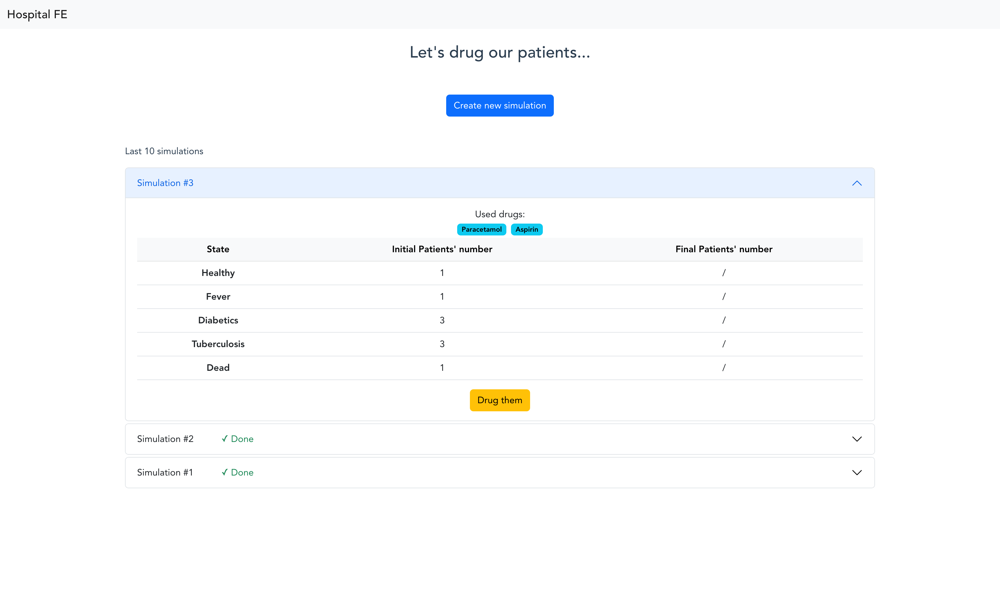

# hostpital-fe

Vue 3 project.

I unit tested the vuex store and the HospitalService methods using jest.
More tests could have been added, such as error handling and the interface behaviour.
But, I did not have the time. 

## Preview



## Project setup
```
yarn install
cd ../hospital-lib
yarn link
cd ../hospital-fe
yarn link hospital-lib
```

### Compiles and hot-reloads for development
```
yarn serve
```

### Compiles and minifies for production
```
yarn build
```

### Lints and fixes files
```
yarn lint
```

### Run tests
```
yarn test
```